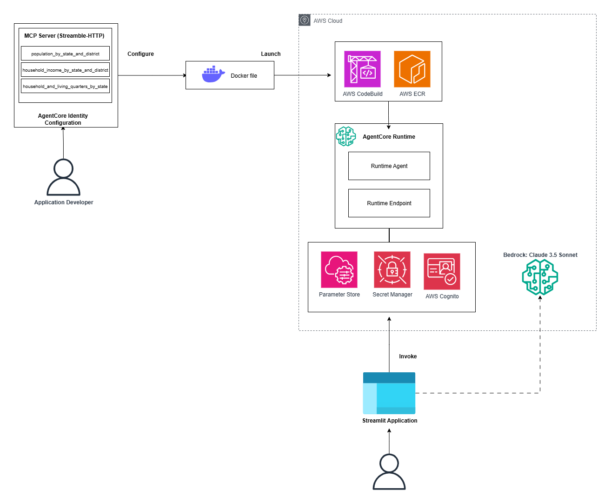

# 🏘️ Malaysian Housing Demand Forecast Agent

This project is an AI-powered housing demand forecasting tool for Malaysia. 
- Streamlit
- FastMCP
- AWS Bedrock AgentCore
- AWS Strands Agent

---
## 🧩 Workflow Overview



---

## 📁 Folder Structure

```bash
.
├── forecast/                    
│   ├── forecast.py       # MCP Server
│   ├── requirements.txt
│   ├── create-deployment.ipynb # AgentCore Runtime config & deployment
│   └── ...               
├── app.py              # Streamlit application             
└── README.md      
```
## AgentCore Deployment
```
cd forecaster
```
run create-deployment.ipynb